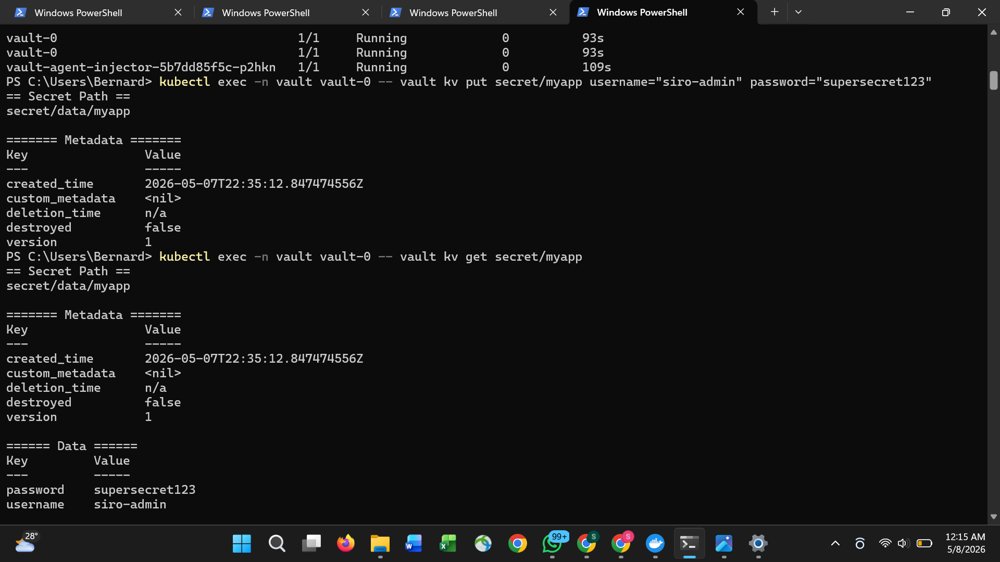
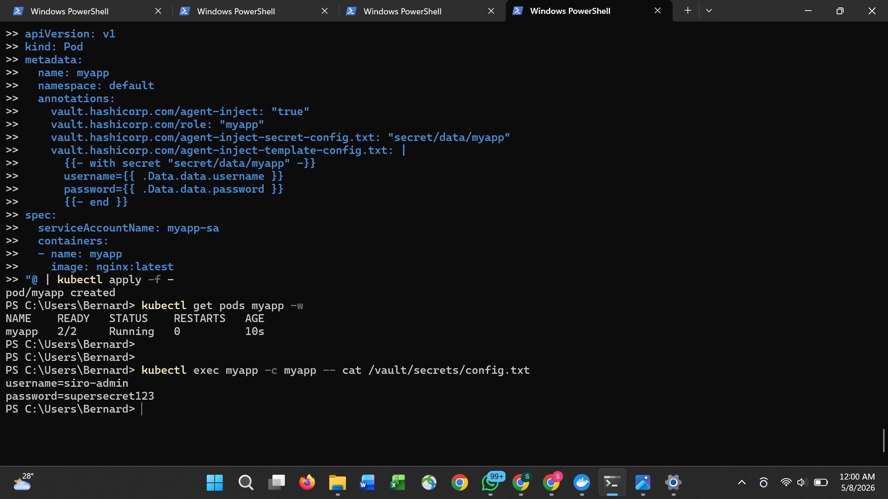

# Kubernetes Secrets Management with HashiCorp Vault

Zero hardcoded credentials. Secrets injected at runtime by Vault agent.
No Kubernetes secrets. No environment variables. No credentials in Git.

## How it works

1. Vault stores secrets in its encrypted KV store
2. A Vault policy defines which paths the app can read
3. A Kubernetes auth role binds the policy to a service account
4. Vault agent injector runs as a sidecar and writes secrets to /vault/secrets/
5. The app reads credentials from the filesystem at runtime

## What was proved

| Test | Result |
|---|---|
| Secret stored in Vault KV | username and password stored at secret/data/myapp |
| Pod injected with secret | /vault/secrets/config.txt populated at runtime |
| Zero hardcoded credentials | No secrets in Git, no K8s secrets, no env vars |
| Least privilege policy | Pod can only read secret/data/myapp, nothing else |

## Evidence

### Secret injected into running pod

### Vault policy scoped to least privilege

## Project structure

manifests/myapp-pod.yaml  -- Pod with Vault agent annotations
vault/myapp-policy.hcl    -- Least privilege Vault policy
screenshots/              -- Evidence from live demo

## Key concepts demonstrated

Vault agent injector -- sidecar container that authenticates with Vault and writes secrets to a shared volume. The app never talks to Vault directly.

Kubernetes auth method -- Vault verifies the pod's service account JWT token against the Kubernetes API to authenticate without static credentials.

Least privilege policy -- the service account can only read one specific path in Vault. No other secrets are accessible.

Secret rotation -- update the secret in Vault and the next pod restart picks up the new value automatically.

## Stack

HashiCorp Vault, Kubernetes, Helm, Docker Desktop

## What I would add next

- Dynamic secrets -- Vault generates short-lived database credentials on demand
- Secret rotation -- automatically rotate credentials on a schedule
- Vault Enterprise -- namespaces for multi-team secret isolation
- External Secrets Operator -- sync Vault secrets to Kubernetes secrets for legacy apps
